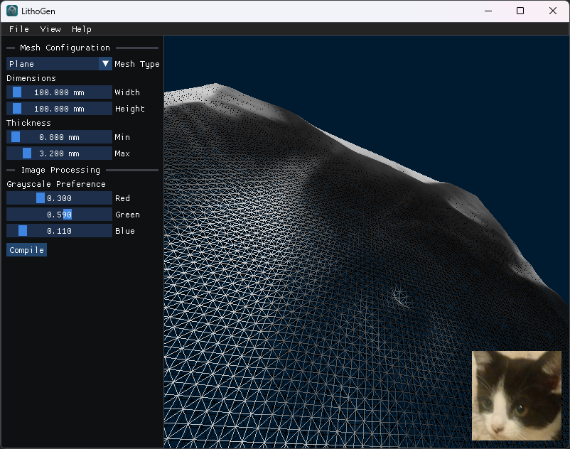

#  LithoGen

A cross-platform lithophane generator with 3D preview and in-depth configuration written in C++ with efficiency,
customizability and usability in mind. Supports loading images of types `jpeg`, `png`, `tga`, `bmp`, `psd`, `gif`,
`hdr`, `pic` and exports to `stl`.

## Installation

Windows users can download the latest binary from
the [GitHub Releases](https://github.com/YellowAtom/lithogen/releases), otherwise it must be built from source.

### Building From Source

The project uses the CMake build system with all dependencies either bundled or automatically downloaded. Therefore,
CMake can be used as normal.

## Dependencies

The official name, source and version of the project dependencies.

| Name                                                                             | Version                                                                                               |
|----------------------------------------------------------------------------------|-------------------------------------------------------------------------------------------------------|
| [Battery Embed](https://github.com/batterycenter/embed)                          | 1.2.19                                                                                                |
| [Glad](https://github.com/Dav1dde/glad)                                          | 2.0.8                                                                                                 |
| [GLFW](https://github.com/glfw/glfw)                                             | 3.4                                                                                                   |
| [GLM](https://github.com/g-truc/glm)                                             | 1.0.1                                                                                                 |
| [Dear ImGui](https://github.com/ocornut/imgui)                                   | 1.91.8                                                                                                |
| [microstl](https://github.com/cry-inc/microstl)                                  | Commit [ec3868a](https://github.com/cry-inc/microstl/commit/ec3868a14d8eff40f7945b39758edf623f609b6f) |
| [Native File Dialog Extended](https://github.com/btzy/nativefiledialog-extended) | 1.2.1                                                                                                 |
| [std_image](https://github.com/nothings/stb)                                     | 2.30                                                                                                  |