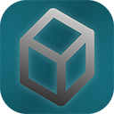

#  LithoGen

A cross-platform lithophane generator with 3D preview and in-depth configuration written in C++ with efficiency,
customizability and usability in mind. Supports loading images of types `jpeg`, `png`, `tga`, `bmp`, `psd`, `gif`,
`hdr`, `pic` and exports to `stl`.

## Installation

Windows users can download the latest binary from
the [GitHub Releases](https://github.com/YellowAtom/lithogen/releases), otherwise it must be built from source.

### Building From Source

[Battery Embed](https://github.com/batterycenter/embed), [GLFW](https://github.com/glfw/glfw), [GLM](https://github.com/g-truc/glm)
and [Native File Dialog Extended](https://github.com/btzy/nativefiledialog-extended) are automatically downloaded and
compiled from source.

#### Bundled Dependencies

Some dependencies require modification to integrate with CMake, below are the official names, sources and versions.

| Name                                            | Version                                                                                               |
|-------------------------------------------------|-------------------------------------------------------------------------------------------------------|
| [Glad](https://github.com/dav1dde/glad)         | 2.0.8                                                                                                 |
| [Dear ImGui](https://github.com/ocornut/imgui)  | 1.91.8                                                                                                |
| [microstl](https://github.com/cry-inc/microstl) | Commit [ec3868a](https://github.com/cry-inc/microstl/commit/ec3868a14d8eff40f7945b39758edf623f609b6f) |
| [std_image](https://github.com/nothings/stb)    | 2.30                                                                                                  |